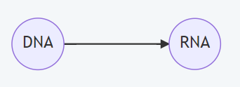
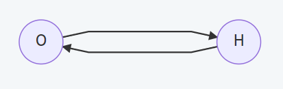
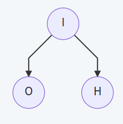
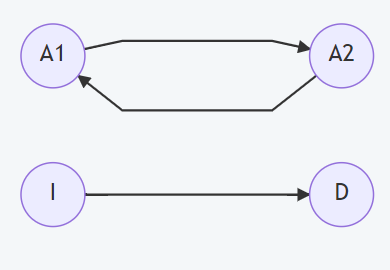
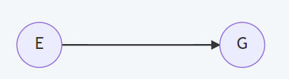
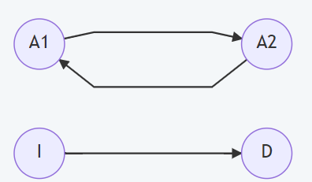
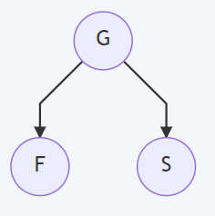
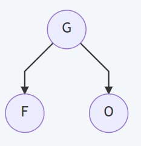
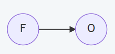

# A blog to introduce you to the basic theory of causal inference(I)


<font size=2>Causal Inference has recently become a hot 
topic to improve the result of many previous methods 
in the area of machine learning, receiving considerable 
feedback. However, the whole system of causal inference 
may seem not so easy for new-comers to get start. So this 
blog is to introduce the basic theory of Causal Inference 
as simply as possible but meanwhile keeps the structure clear.</font>

---
## Part I : Introduction
### 1. What is causal?
It seems a stupid question since everyone can simply 
answer, but, the **causal** relation mentioned this blog 
may different slightly from what **causal** means in our 
daily life. 

Let me introduce some terms first:
```html
Relation:  Causation / Association
Operation: Observation(Condition) / Intervention
```
<br>

#### Causation：
The change of **cause** will lead to the change of **result**.
<!-- 
 -->
</img>
<!--  -->

<font size=2>(A: body temperature &nbsp; &nbsp;B: thermometer)</font>
<br><br>
Empirically, we can simply figure out that it is the change
in body temperature that leads to different readings on the 
thermometer. In this case, A is **independent variable** and 
B is **dependent variable**, which will change correspondingly
on A changed.

<br>

#### Association:
Variables statistically dependent.<br>



<font size="2">(O: oil price &nbsp;&nbsp; H: house price)</font>

We may often see that the house price in a country where 
the oil price is high will also be considerably high, and 
if the house price is dropping quickly, we are likely to
predict that the oil price will also be dropping. **The 
two variables are highly dependent in statistics data.** 
<br><br>
But, it is absurd to conclude that the change in the oil price 
accounts for the change in the house price. Actually, **inflation
caused both oil price and house price to rise**. It made us
cheated by the phenomenon and **misunderstand the association 
relation between oil price and house price as causal 
association**. So, later in this blog, we will refer to variables 
of this type as ***confounder***.



<font size=2>(I: inflation &nbsp;&nbsp;  O: oil price &nbsp;&nbsp;  H: house price)</font>

<br>

#### Observation(Condition):
Observation means directly get the data from the raw statistics 
data and then use it as **prior knowledge** to predict other
variables. For example, if given an unknown thermometer, we
would predict the reading by randomly guess but if we observe
that the patient has caught a fever, we would likely guess 
the reading is at about 39'C.<br>

As described above, observation on the independent variable 
will lead to the change in our prediction on the dependent
variable(P(y)!=P(y|x)). Actually, observation will affect
it's counterpart in all relationships:<br>



```html
P(A1) != P(A1 | A2)
P(A2) != P(A2 | A1)
P(I)  != P(I | D)
P(D)  != P(D | I)

(A1,A2: Two associated variables in association 
I: Independent variable in causation
D: Dependent variable in causation)
```
<br>

#### Intervention 
Intervention means manually changed a variable to a certain
value, for example: if we want to find whether regular exercise
contributes to a higher grade, we assume that regular exercise
has causal effect on good grades:




<font size=2>(E: regular exercise &nbsp;&nbsp; G: good grades)</font>

To prove our assumption, **we command that all students in 
our school must exercise regularly**, and then we surprisingly 
found that the grades of all students has been improved,
which means regular exercise do have causal effect on 
a good grade.(In contrast, **observation** is we only take the students who exercise regularly as example and leave ones exercise irregularly alone.)

In this case, we use **do(E=e) or do(e)** to denote that we
**intervened** on variable E(exercise condition). We change
the variable E of all the students in our school to e(regular exercise)
irrespective of whether the student's exercise condition
is originally regular or irregular if there hadn't been our
experiment.


<br>

Unlike **condition** mentioned above, **intervention** only 
effects the dependent variable as independent variable in 
causal association:



```html
P(A1) = P(A1 | do(A2=a2))
P(A2) = P(A2 | do(A1=a1))
P(I)  = P(I | do(D=d))
P(D)  != P(D | do(I=i))

(A1,A2: Two associated variables in association 
I: Independent variable in causation
D: Dependent variable in causation)
```
<br>

### 2. Why causal inference important?

Actually, most of our present methods in machine learning is
based on association, not causation. Think about the example
of iris:

| L1 | L2 | L3 | L4 | species |
|:---:|:---:|:---:|:---:|:---:|
| 7.0 | 3.2 | 4.7 | 1.4 | setosa |
| 6.4 |	3.2 | 4.5 |	1.5 | setosa |
| 5.1 | 3.5 | 1.4 |	0.2 | versicolor |
| 5.3 | 3.7 | 1.5 |	0.2 | versicolor |
| 5.0 | 3.3 | 1.4 | 0.2 | virginica |

As we have learned in many methods in machine learning,
we use the four features (L1,L2,L3,L4) to predict the species
labels. In this case, the relation between features and 
the species are **association**, not **causation**. Actually
the causal structure should be like this:



<font size=2>(G: gene &nbsp;&nbsp; F: features &nbsp;&nbsp; S: species)</font>

Till now, it seems that just using association is enough, as
we can predict the species at a high accuracy on known its
features, much like predicting the house price based on the
oil price as mentioned above. So, why **causal inference**
needed?

Let's consider another example, where we want to extract
a chemical C from iris flowers, and we get the statistics
data:

| L1 | L2 | L3 | L4 | chemical output |
|:---:|:---:|:---:|:---:|:---:|
| 7.0 | 3.2 | 4.7 | 1.4 | 5.0 |
| 6.4 |	3.2 | 4.5 |	1.5 | 5.0 |
| 5.1 | 3.5 | 1.4 |	0.2 | 2.5 |
| 5.3 | 3.7 | 1.5 |	0.2 | 0.9 |
| 5.0 | 3.3 | 1.4 | 0.2 | 0.9 |

Form this chart, we may easily discover that if the value of
feature L1,L3 and L4 is high, the output of the chemical 
can also be relatively high. If we want to maximize the 
output of the chemical, we may attempt to make the feature
L1 of the flowers higher by fertilizer or other means. But
this will not help since the output of the chemical 
depends largely on the species rather than the features.
Because we misunderstand association as causation, our plan
will go in vain.



<font size="2">(O: the output of the chemical)</font>

<font size="2">(Real situation: Gene control both the features and the output of the chemical)</font>



<font size=2>(Ostensible situation: features have causal effect on the output of the chemical)</font>

